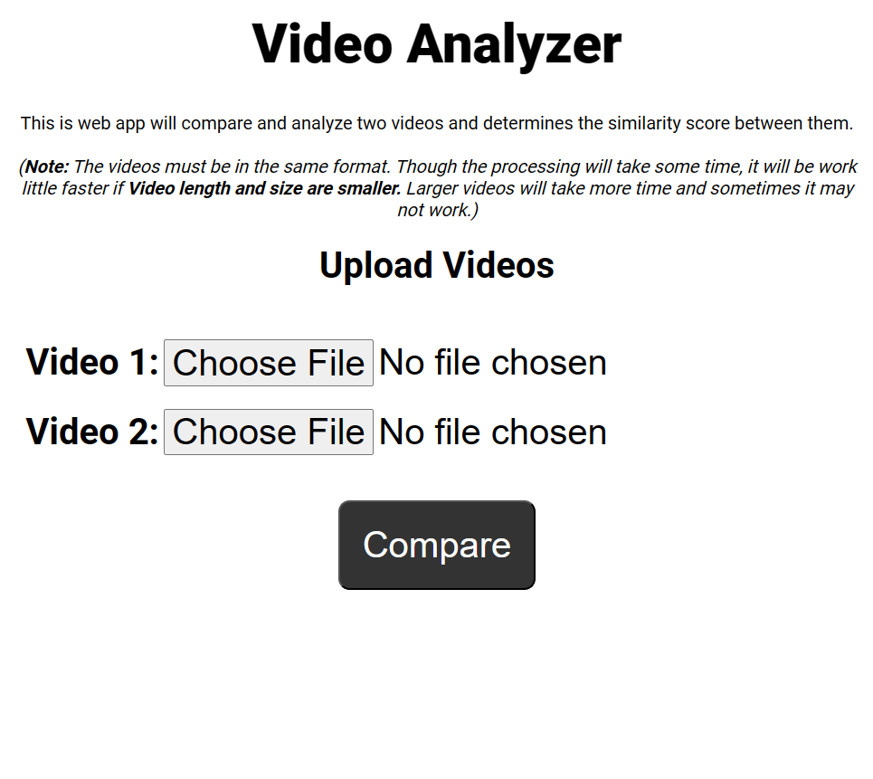
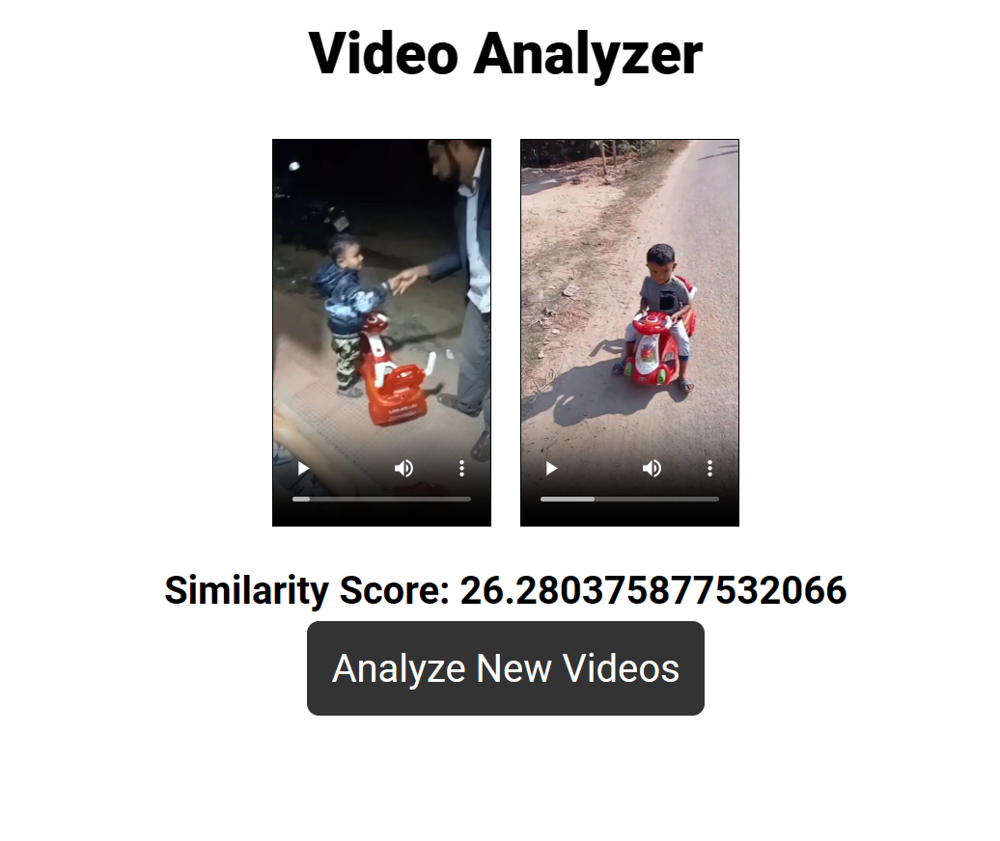

<div align="center">


<h1> Video Analyzer </h1>

<p> This is web app will compare and analyze two videos and determines the similarity score between them.</p>

</div>

<table>
    <tr>
        <td> </td>
        <td> </td>
    </tr>
</table>

## Table of Contents

-   [📜 Instructions to run](#📜-instructions-to-run)
-   [📚 Libraries used and why I am using them](#📚-libraries-used-and-why-i-am-using-them)

## 📜 Instructions to run

1. Clone the repository
    ```bash
    git clone
    ```
2. Change the working directory
    ```bash
    cd video-analyzer
    ```
3. Setup and run `pipenv` environment
    ```bash
    pipenv shell
    ```
4. Install dependencies
    ```bash
    pip3 install -r requirements.txt
    ```
5. Run the app
    ```bash
    python3 app.py
    ```
6. Go to `http://127.0.0.1:5000/`

## 📚 Libraries used and why I am using them

Here are the use cases of the library imports used in the `app.py` script and why they are used for this project:

1. `cv2`: This is the OpenCV library, which is used for image and video processing. In this project, it is used to extract frames from video files.

2. `Flask`: These are all part of the Flask web framework, which is used to create the web application. `Flask` is the main Flask class, redirect and `url_for` are used to redirect the user to different pages, `render_template` is used to render HTML templates, request is used to handle HTTP requests, and `jsonify` is used to return JSON responses.

3. `BadRequest`: This is an exception class from the `Werkzeug` library, which is used to handle HTTP errors. In this project, it is used to raise a BadRequest exception if the user does not upload both videos.

4. `numpy`: This is a numerical computing library for Python. In this project, it is used to perform numerical operations on arrays of video frames.

5. `os`: This is a module for interacting with the operating system. In this project, it is used to join file paths and get the current working directory.

6. `pytube`: This is a library for downloading YouTube videos. In this project, it is used to download YouTube videos for comparison.

7. `scipy.spatial.distance, scipy.io.wavfile, scipy.signal.resample`: These are all part of the `SciPy` library, which is used for scientific computing. In this project, they are used to calculate the similarity between two videos based on their audio and visual features.

8. `skimage`: These are part of the `scikit-image` library, which is used for image processing. In this project, they are used to calculate the structural similarity index (SSIM) between two video frames.

9. `python_speech_features`: This is a library for computing Mel-frequency cepstral coefficients (MFCCs), which are commonly used in speech recognition. In this project, it is used to extract audio features for comparison.

10. `subprocess`: This is a module for running external commands. In this project, it is used to run the ffmpeg command to extract audio from video files.

11. `tempfile`: This is a module for working with temporary files and directories. In this project, it is used to create a temporary directory for storing downloaded videos.

12. `urllib.request`: This is a module for working with URLs. In this project, it is used to download videos from URLs.

13. `librosa`: This is a library for audio analysis. In this project, it is used to extract audio features for comparison.

14. `moviepy`: This is a library for video editing. In this project, it is used to extract audio from video files.

15. `pyAudioAnalysis`: This is a library for audio analysis. In this project, it is used to segment audio files into speech and non-speech regions.
